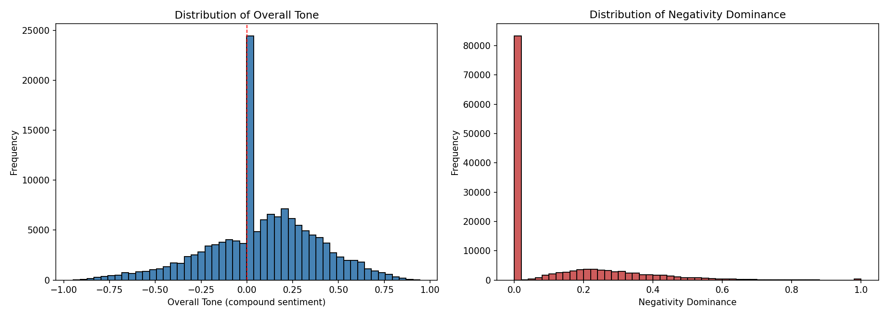
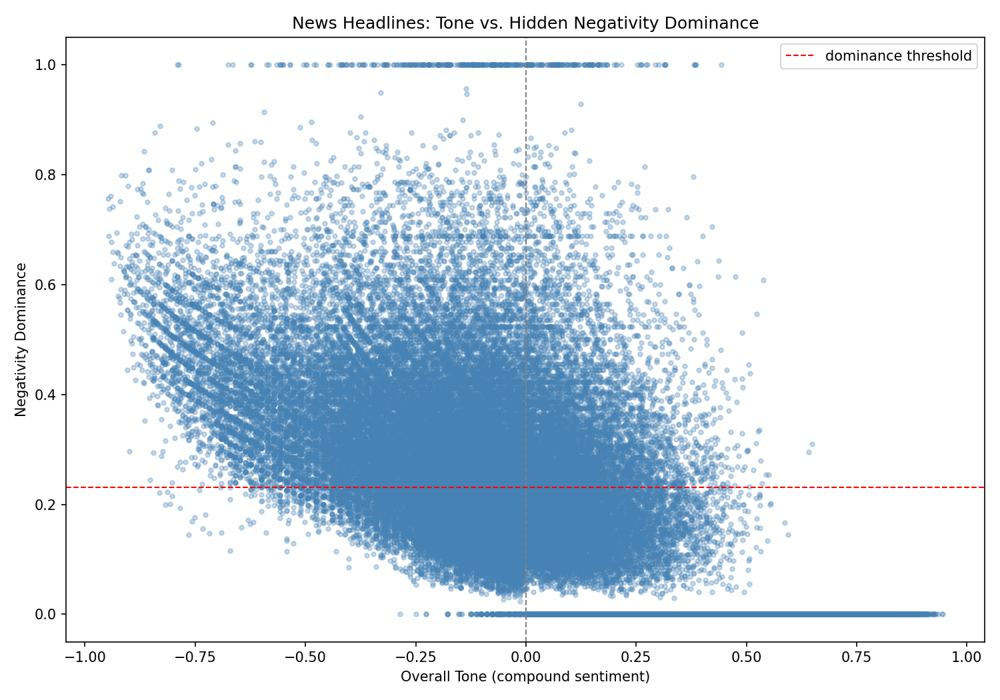

# News Negativity Dominance Scoring

A lexicon-based algorithm for detecting **hidden negativity** in news text: cases where an article's overall tone reads as neutral or positive, but contains a genuinely negative event that a simple average sentiment score would mask.

Built as a self-directed project to explore computational methods for analyzing negativity in news content, in the context of research on news diets and negativity exposure.

---

## Motivation

Standard sentiment analysis reduces a document to a single average score. But averaging can hide important information: a mostly positive article that briefly mentions a death, a layoff, or a tragedy will often average out to "neutral," even though a human reader would clearly register the negative event.

This project asks: **can we detect negativity that is diluted by surrounding positive framing, rather than just measuring overall tone?**

---

## Method

**Dataset:** [Kaggle News Category Dataset](https://www.kaggle.com/datasets/rmisra/news-category-dataset) (~140,000 HuffPost articles, 2012–2022). Each document is constructed by merging a headline and its short description into a single text field.

**Sentiment engine:** [VADER](https://github.com/cjhutto/vaderSentiment) (via NLTK), chosen for its speed, interpretability, and suitability for short text.

**Pipeline:**
1. Merge `headline` + `short_description` into one `text` field per article.
2. Split `text` into sentences using NLTK's `sent_tokenize`.
3. Score each sentence with VADER, producing `compound`, `neg`, and `pos` scores.
4. Compute two document-level metrics (below).

### Metrics

**`overall_tone`**: the average compound score across all sentences in the document. Range: `[-1, 1]`.

**`negativity_dominance`**: the maximum `neg` score among sentences where `neg > pos` (i.e. sentences where negative sentiment outweighs positive sentiment). Range: `[0, 1]`. If no sentence is negativity-dominant, the score is `0`.

```python
def negativity_dominance_scoring(sent_arr):
    compound = []
    neg = []

    for sent in sent_arr:
        scores = sia.polarity_scores(sent)
        compound.append(scores['compound'])
        if scores['neg'] > scores['pos']:
            neg.append(scores['neg'])

    avg_compound = sum(compound) / len(compound)
    max_neg = max(neg) if neg else 0

    return avg_compound, max_neg
```

Reporting these as **two separate axes**, rather than merging them into one number, is a deliberate design choice: `overall_tone` answers "what's the general sentiment of this document," while `negativity_dominance` answers "did something negative happen here, even briefly."

---

## Design iteration: why `max`, not a weighted average

An earlier version of this metric combined a document's proportion of negative sentences (`alpha`) with the average strength of those sentences:

```
negativity_dominance_v1 = alpha × avg_neg
```

Testing this at scale on the full 140K-document dataset showed a problem: this formula strongly correlates with `overall_tone` and rarely produces high values when a document has positive-leaning tone, because it dilutes a single negative sentence by the proportion of the document it represents. A document with 1 strongly negative sentence out of 2 could never score as high as intended, since `alpha` alone caps the signal.

Switching to **`max(neg scores of dominant sentences)`** fixed this: a single sharp negative sentence is no longer diluted by the rest of the document. This was validated empirically: the revised metric produces meaningfully high `negativity_dominance` scores across the *full range* of `overall_tone`, including clearly positive documents, which the `alpha`-weighted version did not.

This aggregation choice is intentionally suited to **short documents** (2-4 sentences, as in headline + description). For longer documents (full articles), a single `max` sentence is less informative, and a different aggregation, such as the average of the top-*k* negative sentences, would likely better capture sustained negativity rather than a single spike. This is noted as future work below.

---

## Results

### Distributions (full dataset, n = 140,854)



- **`overall_tone`** is roughly bell-shaped and centered slightly above zero (mean ≈ 0.08), consistent with the generally neutral-to-positive framing conventions of headline writing. A sharp spike exactly at 0 corresponds to documents with no sentiment-bearing words detected at all.
- **`negativity_dominance`** is zero for the majority of documents (~59%), meaning most headline+description pairs contain no sentence where negativity outweighs positivity. Where dominance is nonzero, scores spread across the full range, including a small but distinct cluster at 1.0 (documents containing at least one maximally negative sentence).

### Tone vs. dominance



- At the negative-tone extreme (tone approaching -1), dominance is consistently high. This is expected, since an overall negative average is usually driven by sentences that are individually negative.
- The more analytically interesting region is **tone >= 0 with elevated dominance**: documents that read as neutral or positive on average but contain a genuine negative spike. This is the "hidden negativity" phenomenon the metric was designed to surface, and its presence, visible as points scattered above the positive-tone region, including a horizontal band at dominance = 1.0 spanning positive tone values, confirms the metric captures something `overall_tone` alone misses.
- The two horizontal bands (dominance = 0 and dominance = 1) are structural: the bottom band holds every document where no sentence was negativity-dominant regardless of overall tone, and the top band holds documents where at least one (often short, blunt) sentence hit VADER's negativity ceiling.

### Constructed test cases

| Case | Sentence 2 | `overall_tone` | `negativity_dominance` |
|---|---|---|---|
| Procedural framing | "...forced to lay off a third of its teaching staff." | +0.057 | 0.15 |
| Emotional framing (same event) | "...outrage and heartbreak after brutal layoffs devastated..." | -0.186 | 0.58 |
| Hidden negativity | "...tragic warehouse fire killed two workers." (paired with positive headline) | +0.012 | 0.43 |
| Contrastive structure | "Despite early fears of disaster, the surgery was a complete success." | +0.117 | 0.00 |

These controlled examples surface two distinct properties of the underlying lexicon, discussed below.

---

## Limitations

- **Sensitivity to vocabulary, not event severity.** The same underlying event (staff layoffs) produced a nearly 4x difference in `negativity_dominance` (0.15 vs. 0.58) depending on whether it was described procedurally or with emotionally charged language. This is inherited directly from VADER, which is tuned on social-media-style text and reacts more strongly to visceral wording than to clinical descriptions of real harm (layoffs, displacement, closures).
- **Document length assumption.** With most documents limited to 2 sentences, `negativity_dominance` reduces to "the worse of at most two scores." This is appropriate at this scale but would need to be redesigned (e.g., top-*k* averaging) for longer, multi-paragraph text.
- **Sentence-level scoring, not full-document semantics.** VADER scores sentences independently; it does not track discourse-level context across sentences (e.g., whether an earlier sentence's negativity is resolved or reversed later in the document).
- **Contrastive structures are sometimes handled correctly, sometimes not.** In one test, VADER correctly resolved "despite fears of disaster, the surgery was a complete success" as non-negative, avoiding a false positive from the negative-sounding setup clause. This suggests VADER's behavior here is inconsistent rather than uniformly biased, and shouldn't be assumed to generalize without further testing.

## Future Work

- Extend to full-length article text and compare `max`-based scoring against a top-*k* average, which should better capture sustained (rather than single-spike) negativity in longer documents.
- Validate against a small hand-labeled sample to quantify agreement with human judgments of "hidden negativity."
- Compare against a classic ML classifier (TF-IDF + logistic regression) trained on labeled news sentiment data, to see whether a supervised approach reduces the vocabulary-sensitivity issue observed here.
- Break results down by category/outlet to explore whether negativity dominance varies systematically across news topics.

---

## Requirements

```
nltk
pandas
numpy
matplotlib
```

```python
import nltk
nltk.download('vader_lexicon')
nltk.download('punkt')
nltk.download('punkt_tab')
```

## Usage

```python
from nltk.sentiment.vader import SentimentIntensityAnalyzer
from nltk.tokenize import sent_tokenize

sia = SentimentIntensityAnalyzer()

text = "Tech startup celebrates record-breaking funding round. The announcement came days after a tragic warehouse fire killed two workers."
sentences = sent_tokenize(text)
overall_tone, negativity_dominance = negativity_dominance_scoring(sentences)
```

## Repository Structure

```
├── negativity_dominance_scoring.ipynb   # full analysis notebook
├── histograms.png                        # distribution plots
├── quadrant_plot.png                     # tone vs. dominance scatter
└── README.md
```
